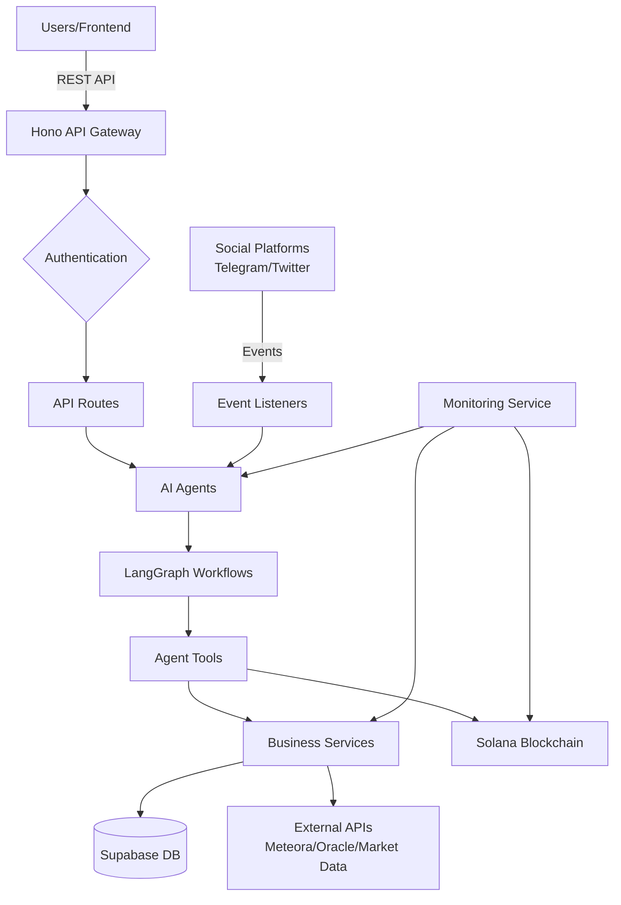
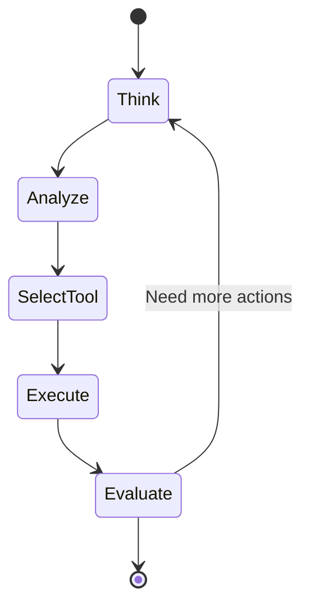
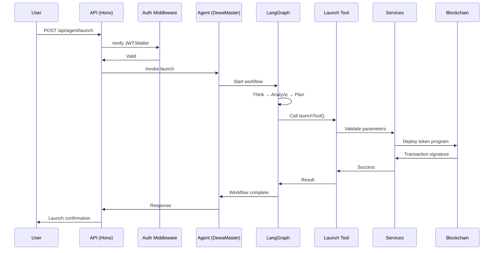
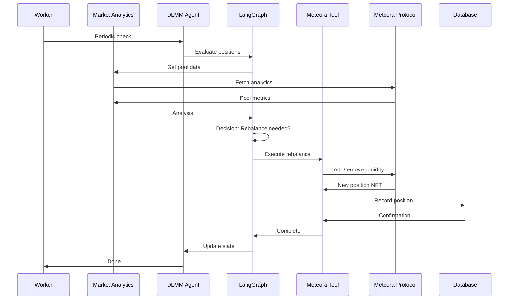
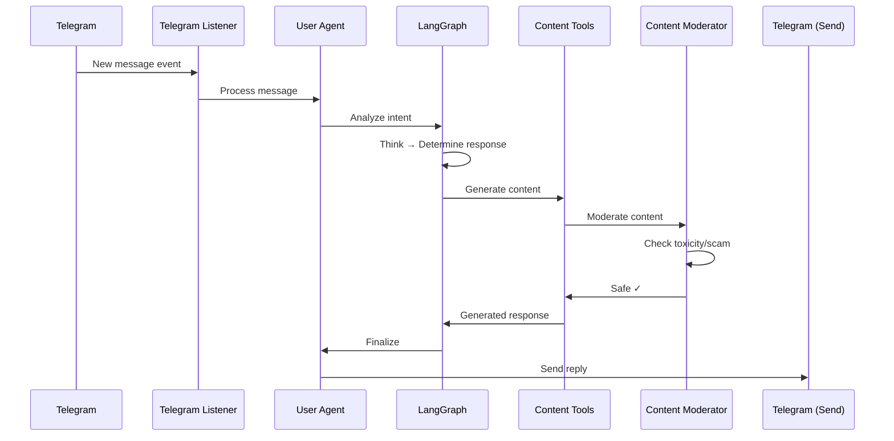
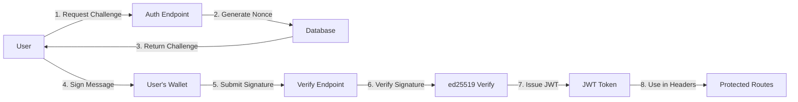
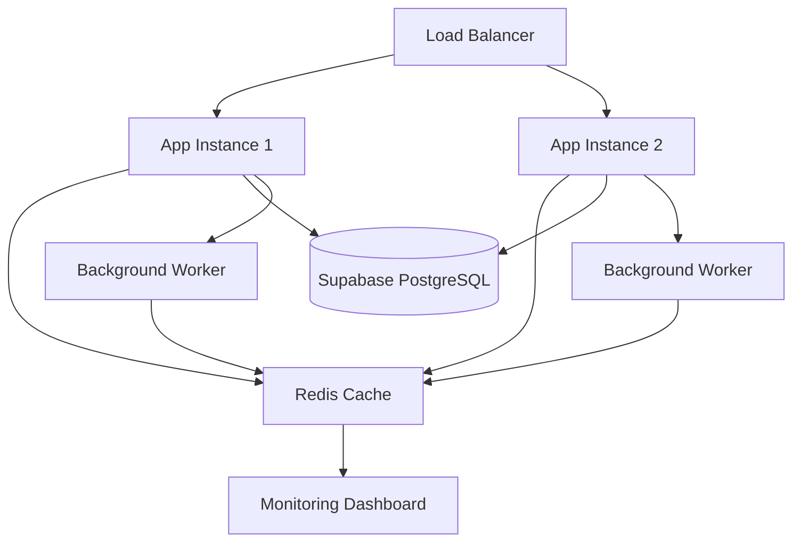

# Dewa.fun AI Agent Backend - Architecture Documentation

## System Overview

Dewa.fun is an autonomous AI agent system built on TypeScript, Hono, and LangGraph that manages token launches, DeFi operations (Meteora DLMM), and social media engagement for the Dewa.fun platform.

## High-Level Architecture



## Component Layers

### 1. **Entry Points**

#### `src/index.ts` - Main API Server
- Hono-based HTTP server
- Middleware stack (Auth, Rate Limiting, Validation)
- Route registration
- CORS handling
- Port: Configurable (default from env)

#### `src/worker.ts` - Autonomous Background Worker
- Periodic agent execution (30-60 min intervals)
- Scheduled tasks
- Background job processing
- System health monitoring

### 2. **Middleware Layer** (`src/middleware/`)

Request processing pipeline:

```
Request → Auth → Wallet Verify → Rate Limit → Input Validate → Content Moderate → Route Handler
```

**Middleware Components:**
- **`auth.ts`**: JWT verification & wallet signature validation
- **`walletVerifier.ts`**: Challenge-response signature protocol
- **`rateLimiter.ts`**: Sliding window rate limiting (IP & user-based)
- **`inputValidator.ts`**: XSS/SQL injection prevention, data sanitization
- **`contentModerator.ts`**: AI-powered toxicity/scam detection

### 3. **API Routes** (`src/routes/`)

#### Agent Routes (`/api/agent/*`)
- Token launch triggers
- Agent status queries
- Configuration updates

#### DLMM Routes (`/api/dlmm/*`)
- Liquidity position management
- Pool analytics
- Rebalancing operations

#### Social Routes (`/api/social/*`)
- Social persona configuration
- Engagement metrics
- Content scheduling

### 4. **AI Agent Layer** (`src/agents/`)

Autonomous agents powered by LangGraph:

```
┌─────────────────────────────────────┐
│         DewaMaster Agent            │
│  - Strategic coordination           │
│  - Multi-agent orchestration        │
│  - High-level decision making       │
└──────────┬──────────────────────────┘
           │
    ┌──────┴───────┐
    │              │
┌───▼────┐   ┌────▼─────┐
│DLMM    │   │User      │
│Agent   │   │Agent     │
│- Liquidity│ │- Support │
│- Rebalance│ │- Interaction│
└────────┘   └──────────┘
```

**Agent Types:**
- **`dewaMaster.ts`**: Master coordinator for all agents
- **`dlmmAgent.ts`**: Automated liquidity management on Meteora
- **`dlmmAdvanced.ts`**: Advanced DLMM strategies
- **`userAgent.ts`**: User interaction & support

### 5. **LangGraph Workflows** (`src/graphs/`)

State machine graphs defining agent behavior:



**Workflow Nodes:**
- **Think**: Context analysis & strategy formation
- **Analyze**: Data gathering from services
- **SelectTool**: Tool selection based on intent
- **Execute**: Tool execution with parameters
- **Evaluate**: Result assessment & next action decision

### 6. **Agent Tools** (`src/tools/`)

Callable functions for agent actions:

**Launch Tools:**
- `launchTool.ts`: Token launch automation (B2B/B2C schemes)

**DeFi Tools:**
- `meteoraManager.ts`: Liquidity pool operations
- `meteoraDlmm.ts`: DLMM-specific functions
- `governanceTools.ts`: Buyback/burn execution

**Social Tools:**
- `contentTools.ts`: Content generation
- `socialService.ts`: Social media posting
- `metaplexBadges.ts`: NFT badge management

**Utilities:**
- `solanaTools.ts`: Solana blockchain interactions
- `diceBatch.ts`: DICE casino operations
- `bagsApi.ts`: Portfolio tracker integration

### 7. **Business Services** (`src/services/`)

Core business logic encapsulation:

**Market Data:**
- `marketDataService.ts`: Real-time price feeds
- `oracleService.ts`: Price oracle integration
- `dlmmAnalyticsService.ts`: DLMM pool analytics

**Operations:**
- `meteoraService.ts`: Meteora pool management
- `meteoraPositionService.ts`: Position tracking & PnL
- `transactionService.ts`: Transaction monitoring

**Analytics:**
- `socialAnalyticsService.ts`: Social engagement metrics
- `monitoringService.ts`: System health & alerting

### 8. **Listeners** (`src/listeners/`)

Event-driven social platform integration:

**Telegram Listener:**
- Real-time message monitoring
- Command parsing
- Auto-responses based on agent state

**Twitter Listener:**
- Mention tracking
- Hashtag monitoring
- Engagement response

### 9. **Core Infrastructure** (`src/core/`)

**Configuration:**
- `config.ts`: Environment variables & constants
- `encryption.ts`: API key encryption/decryption
- `supabase.ts`: Database client setup
- `llmWrapper.ts`: LLM provider abstraction (OpenAI/Anthropic)

### 10. **Utilities** (`src/utils/`)

Foundation utilities:
- `logger.ts`: Winston structured logging
- `errorHandler.ts`: Global error handling
- `errors.ts`: Custom error classes
- `databaseService.ts`: Retry logic & transactions
- `secureMemory.ts`: Secure credential storage with auto-zeroing
- `transactionValidator.ts`: Transaction validation

### 11. **State Management** (`src/state/`)

Type-safe state schemas using Zod:
- Agent state definitions
- Message history tracking
- Tool call results
- Context propagation

---

## Data Flow Examples

### Example 1: Token Launch Flow



### Example 2: Autonomous DLMM Rebalancing



### Example 3: Social Media Response Flow



---

## Security Architecture

### Authentication Flow



### Security Layers

1. **Transport**: HTTPS enforcement
2. **Authentication**: JWT + Wallet signatures
3. **Authorization**: Role-based access control
4. **Input Validation**: XSS/SQLi prevention
5. **Rate Limiting**: DDoS protection
6. **Content Moderation**: AI-powered filtering
7. **Secure Storage**: Encrypted credentials with auto-zeroing

---

## Deployment Architecture



---

## Technology Decisions

### Why Hono?
- **Performance**: Fastest JavaScript web framework
- **Lightweight**: Minimal footprint
- **TypeScript-native**: Built-in type safety
- **Middleware**: Composable middleware system
- **Edge-ready**: Can deploy to edge environments

### Why LangGraph?
- **Stateful**: Maintains conversation context
- **Cyclic graphs**: Supports loops for agent reasoning
- **Tool integration**: Easy tool calling patterns
- **Human-in-the-loop**: Supports intervention points

### Why Supabase?
- **PostgreSQL**: Full SQL power
- **Real-time**: Built-in subscriptions
- **Auth integration**: Row-level security
- **Cost-effective**: Generous free tier

---

## Performance Considerations

- **Connection pooling**: Supabase client reuse
- **Caching**: Redis for frequently accessed data
- **Async operations**: Non-blocking I/O throughout
- **Batch operations**: Consolidated blockchain calls
- **Lazy loading**: On-demand module imports

---

## Monitoring & Observability

Built-in monitoring provides:
- **Metrics**: Gauges, counters, histograms
- **Health checks**: All services monitored
- **Alerts**: Configurable thresholds
- **Logging**: Structured JSON logs with Winston
- **Tracing**: Request flow tracking

---

## Future Enhancements

1. **Multi-agent collaboration**: Enhanced inter-agent communication
2. **Advanced ML**: Predictive analytics for market movements
3. **Cross-chain expansion**: Support for additional blockchains
4. **Enhanced governance**: DAO integration for community decisions
5. **Mobile notifications**: Push notification system

---

## Contributing

When adding new features:
1. Follow existing folder structure
2. Add comprehensive tests
3. Update this documentation
4. Ensure type safety (no `any` types)
5. Document all public APIs

---

*Last updated: March 2026*
