# Data Flow Diagrams

This document provides detailed data flow diagrams for all major operations in the Dewa.fun AI Agent Backend.

## Table of Contents

1. [User Authentication Flow](#user-authentication-flow)
2. [Token Launch Flow](#token-launch-flow)
3. [DLMM Rebalancing Flow](#dlmm-rebalancing-flow)
4. [Social Media Response Flow](#social-media-response-flow)
5. [Autonomous Agent Decision Loop](#autonomous-agent-decision-loop)
6. [Content Moderation Flow](#content-moderation-flow)

---

## User Authentication Flow

### Challenge-Response Authentication

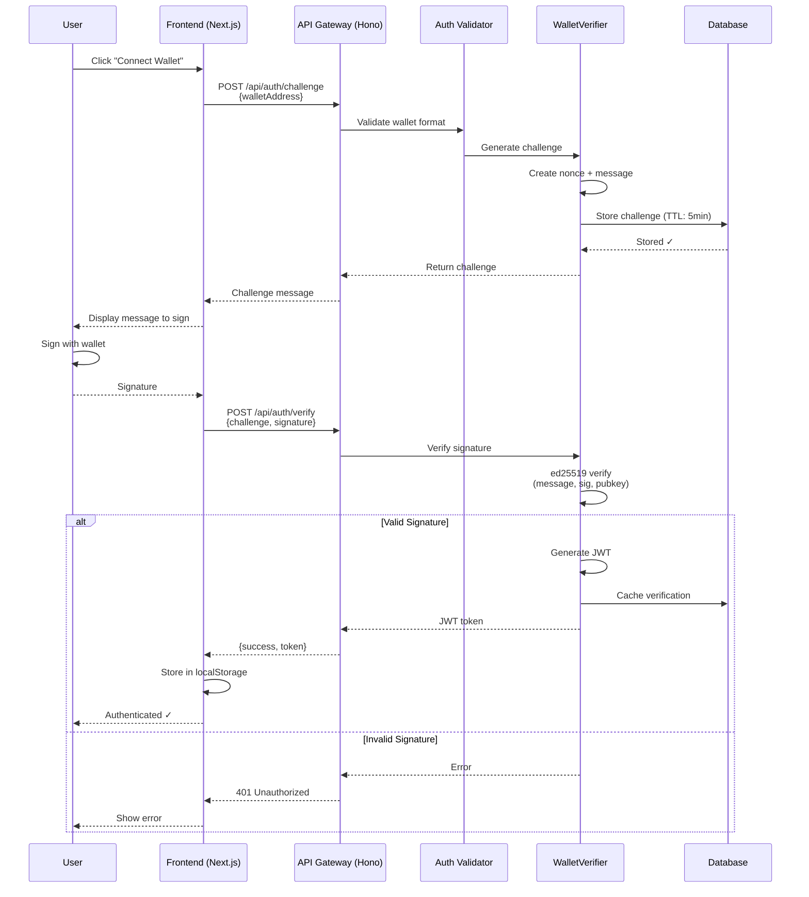

### Protected Route Access

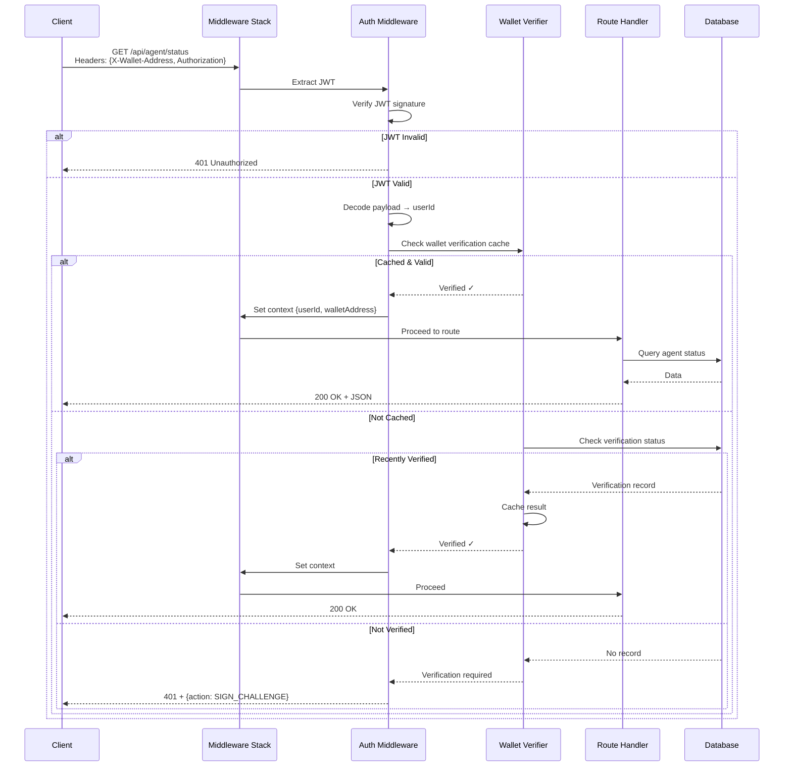

---

## Token Launch Flow

### Complete Launch Process

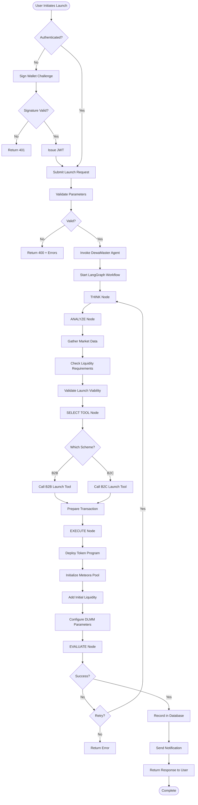

### Detailed Transaction Flow

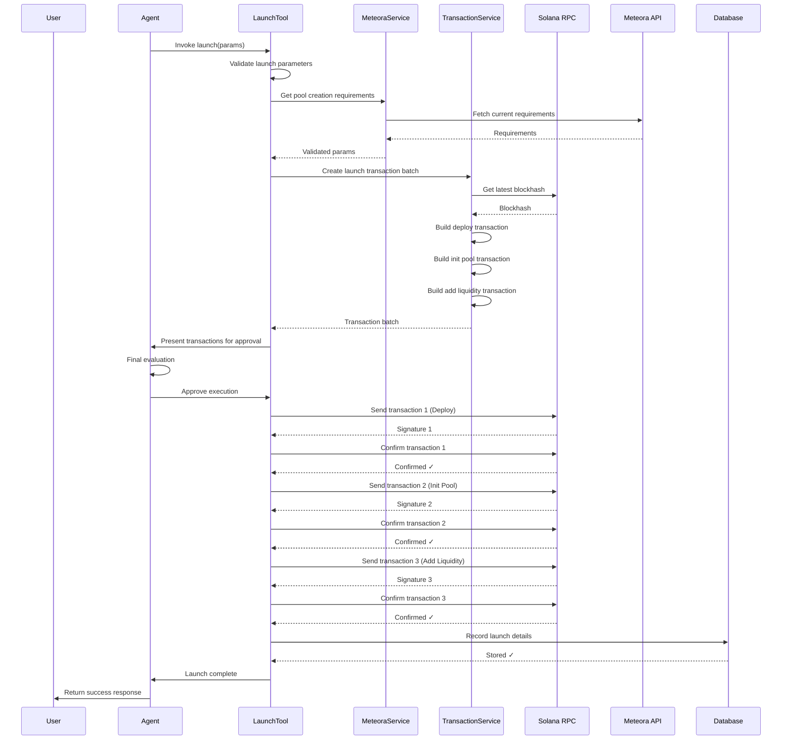

---

## DLMM Rebalancing Flow

### Autonomous Rebalancing Cycle

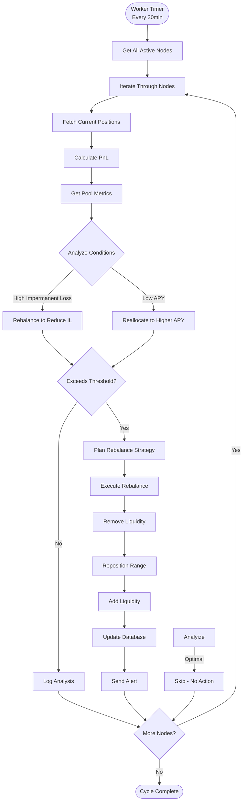

### Position Management Details

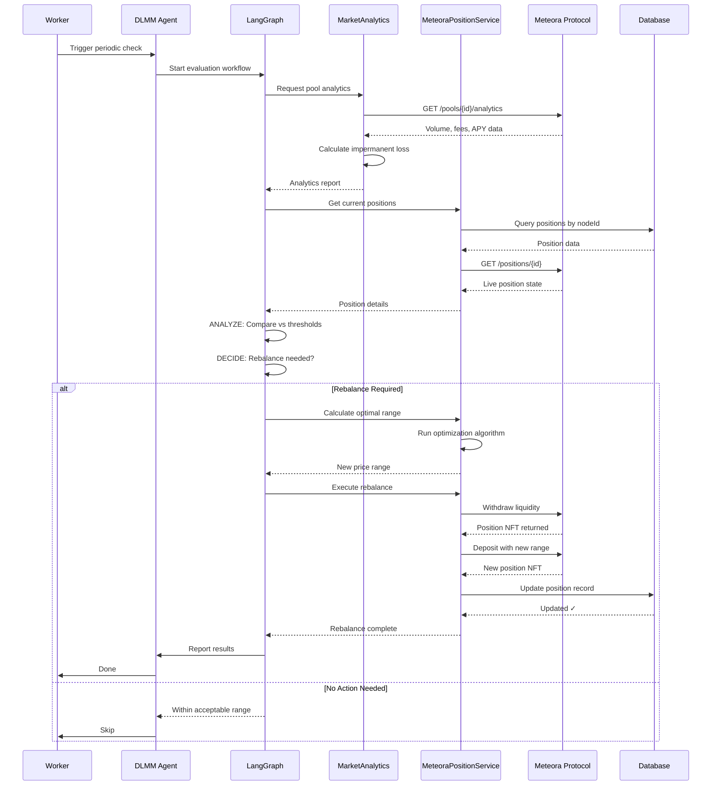

---

## Social Media Response Flow

### Telegram Message Processing

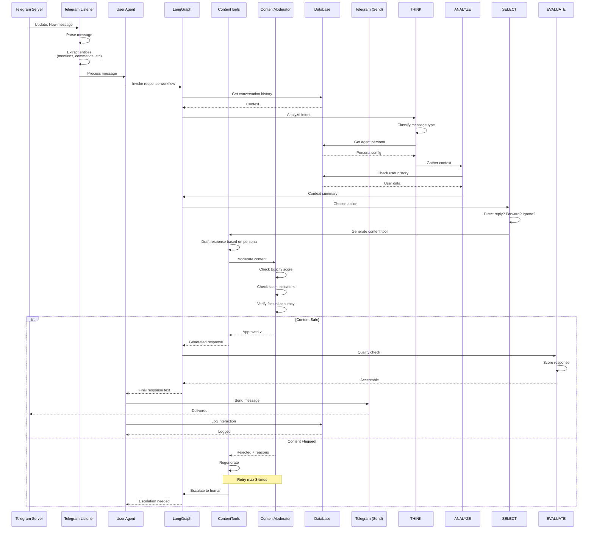

### Twitter Mention Monitoring

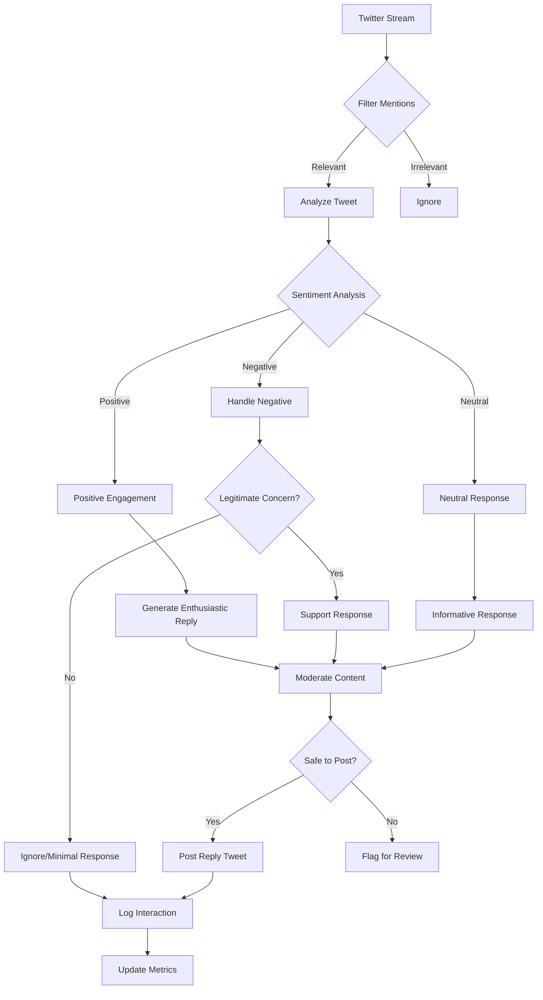

---

## Autonomous Agent Decision Loop

### OODA Loop Implementation

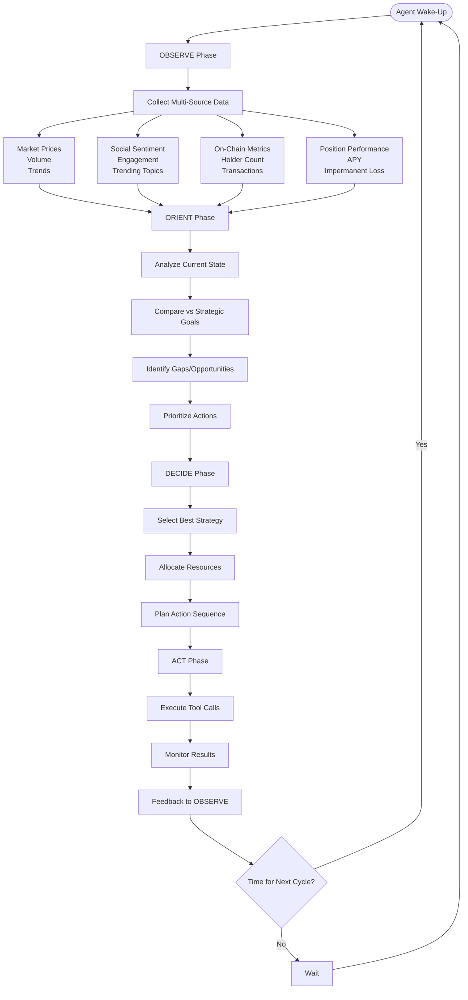

### Tool Selection Logic

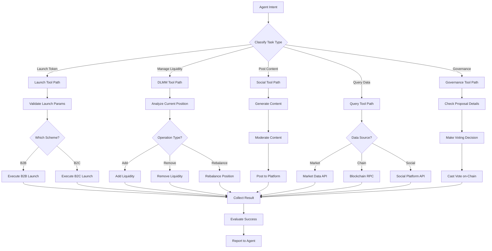

---

## Content Moderation Flow

### Multi-Layer Content Filtering

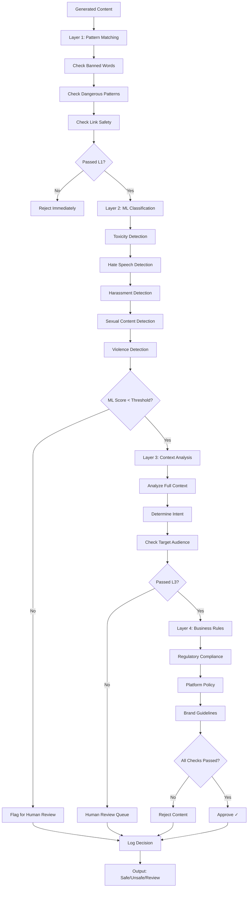

---

*Last updated: March 2026*
